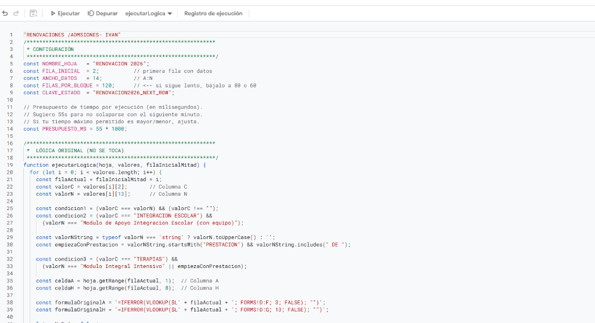

<div align="center">

# 🔄 Sistema de Renovación y Admisión 2026

### Automatización completa del proceso de renovaciones de prestaciones

[](https://script.google.com)
[](https://sheets.google.com)
[](https://developers.google.com/apps-script/reference/gmail)

<br/>

> **Assistire — Centro de Rehabilitación Integral**
>
> Script que procesa miles de filas de pacientes, evalúa sus condiciones de cobertura y aplica resultados de renovación automáticamente — respetando los límites de ejecución de Google (6 min/trigger).

</div>

---

## 📸 Screenshot

<div align="center">
  
  <br/><em>Editor de Google Apps Script — Lógica de procesamiento por bloques</em>
</div>

---

## ⚡ El problema que resuelve

Renovar cientos de prestaciones médicas manualmente en una hoja de Google Sheets es lento, propenso a errores y tarda horas. Este script procesa todo automáticamente con un trigger de 1 minuto, manejando la restricción de ejecución de Google de forma robusta.

---

## 🚀 Funcionalidades

| Feature | Descripción |
|---|---|
| ⏱️ **Procesamiento por bloques** | Procesa 120 filas por trigger de 1 minuto con corte automático a los 55s |
| 💾 **Estado persistente** | Guarda el progreso con `PropertiesService` entre ejecuciones |
| 🔒 **Lock de concurrencia** | `LockService` evita que dos triggers corran en paralelo |
| 📊 **Lógica condicional** | Distingue entre Integración Escolar, Terapias y Módulos |
| 📧 **Emails automáticos** | Notifica a pacientes el estado de su renovación vía `GmailApp` |
| ▶️ **Control manual** | Funciones para iniciar, pausar y resetear el proceso desde el menú |
| 🔄 **Anti-duplicación** | Clave de estado `PropertiesService` evita reprocesar filas ya renovadas |

---

## 🔁 Flujo del sistema

```
Google Sheets "RENOVACION 2026"
         │
         ▼
[Trigger cada 1 min] → ejecutarLogica()
         │
         ├─ Leer bloque de 120 filas desde NEXT_ROW
         │
         ├─ Por cada fila:
         │    ├─ Columna C = tipo de prestación
         │    ├─ Columna N = módulo/detalle
         │    └─ Evaluar condición → aplicar resultado en col A y H
         │
         ├─ Guardar posición actual en PropertiesService
         │
         └─ Si quedan < 55s → cortar y esperar el siguiente trigger
                │
                ▼
         [Proceso terminado] → Emails automáticos a pacientes
```

---

## ⚙️ Archivos del proyecto

| Archivo | Función |
|---|---|
| `importante.gs` | Lógica principal de validación, procesamiento por bloques y triggers |
| `duplicado.gs` | Procesamiento de formularios de respuesta y detección de duplicados |
| `emails_renovacion.gs` | Envío automático de emails con estado de renovación a cada paciente |

---

## 🛠️ Stack técnico

| Tecnología | Uso |
|---|---|
| **Google Apps Script** | Runtime de ejecución serverless |
| **Google Sheets API** | Lectura/escritura de datos de pacientes |
| **GmailApp** | Envío de emails de notificación |
| **PropertiesService** | Persistencia del estado entre ejecuciones |
| **LockService** | Mutex para evitar ejecuciones concurrentes |
| **ScriptApp Triggers** | Scheduler de 1 minuto por tiempo |

---

## 🔧 Configuración

```javascript
// Parámetros ajustables al inicio del script
const NOMBRE_HOJA     = "RENOVACION 2026";
const FILA_INICIAL    = 2;              // Primera fila con datos
const ANCHO_DATOS     = 14;             // Columnas A:N
const FILAS_POR_BLOQUE = 120;          // Bajar a 80-60 si hay timeouts
const PRESUPUESTO_MS  = 55 * 1000;     // Corte a los 55s de 60 disponibles
```

---

## 📋 Lógica condicional de renovación

```javascript
// Ejemplo simplificado de la lógica de evaluación
const condicion1 = (valorC === valorN) && (valorC !== "");
const condicion2 = (valorC === "INTEGRACION ESCOLAR") &&
                   (valorN === "Modulo de Apoyo Integracion Escolar (con equipo)");
const condicion3 = (valorC === "TERAPIAS") &&
                   (valorN === "Modulo Integral Intensivo" || empiezaConPrestacion);
```

---

## 👤 Autor

**Iván De la Torre** — Data Quality & Web Developer · Buenos Aires, Argentina

[](https://ivan-de-la-torre-portfolio.vercel.app)
[](https://github.com/Delatorreivan1998)
